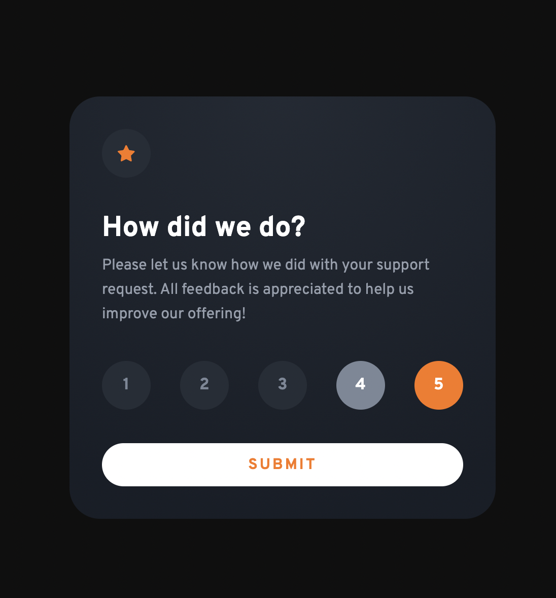
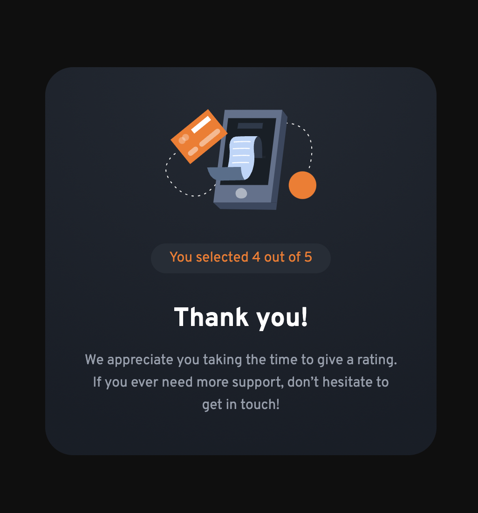

# Frontend Mentor - Interactive rating component solution

This is a solution to the [Interactive rating component challenge on Frontend Mentor](https://www.frontendmentor.io/challenges/interactive-rating-component-koxpeBUmI). Frontend Mentor challenges help you improve your coding skills by building realistic projects. 

## Table of contents

- [Overview](#overview)
  - [The challenge](#the-challenge)
  - [Screenshot](#screenshot)
  - [Links](#links)
- [My process](#my-process)
  - [Built with](#built-with)
  - [What I learned](#what-i-learned)
  - [Continued development](#continued-development)
  - [Useful resources](#useful-resources)
- [Author](#author)
- [Acknowledgments](#acknowledgments)

## Overview
  Interactive rating component - challenge from Frontend Mentor - completed by Tu Le
  This small project test you the basic knowledge of manipulating the DOM using Javascript, toggle css class, changing the style of an element and handle logics using Javascript functions.

### The challenge
  Interactive rating component 
  
  Your users should be able to:

  _ Select and submit a number rating
  _ See the "Thank you" card state after submitting a rating
  _ View the optimal layout for the app depending on their device's screen size
  _ See hover states for all interactive elements on the page

### Screenshot




### Links

- Solution URL: [Add solution URL here](https://your-solution-url.com)
- Live Site URL: [Add live site URL here](https://interactive-rating-component-tule.netlify.app/)

## My process

### Built with

- Semantic HTML5 markup
- CSS custom properties
- Flexbox
- CSS/JS Modal
- Netlify 


### What I learned

In this project, I used the css root variable 'var(--)' to manage the colors and fonts of the website. I import fonts direct into the css file using @import url('...'). And use media query '@media screen and (max-width: 480px) {}' for responsive design. 

The difficult part of this project is to know which rating number has selected, and how to update the dom based on this selected number. A custom JS function help to handle this logic 'function update(idx)'


To see how you can add code snippets, see below:

```css
@import url('https://fonts.googleapis.com/css2?family=Overpass:wght@400;700&family=Roboto:ital,wght@0,300;0,700;1,300&family=Rubik+Mono+One&display=swap');

:root {
  --font-family: 'Overpass', sans-serif;
  --primary-color: #FF8A71;
  --white-color: hsl(0, 0%, 100%);
  --black-color: #0f0f0f;
  --orange: #FC7614;
  --light-grey-color: hsl(217, 12%, 63%);
  --medium-grey-color:hsl(216, 12%, 54%);
  --darkblue-color: hsl(213, 19%, 18%);
  --very-darkblue-color: hsl(213, 19%, 18%);
}
@media screen and (max-width: 480px) {
    .container {
    width: 327px;
    height: 360px;
    padding: 24px;
  }
  .....
}
```
```js
let ratingValue = 0

numbers.forEach((num, idx) => {
  num.addEventListener('click', () => {
    ratingValue = idx + 1
    update(idx)
  })
})
function update(idx) {
  numbers.forEach((num) => num.classList.remove('select'))
  numbers[idx].classList.add('select')
}
```

### Continued development
  Practising with more projects that involved Javascript to handle the web logic and update the DOM is my focusing to help me strengthen my JS part.

### Useful resources

- [Resource 1 - CSS/JS Modal](https://www.w3schools.com/howto/howto_css_modals.asp) - CSS/JS Modal - for building thankyou form after submit.

## Author

- Website - [Tu Le](https://mtle.nl/)
- Frontend Mentor - [@khach2010](https://www.frontendmentor.io/profile/khach2010)


## Acknowledgments

I use Progress-Steps project from "50 Projects In 50 Days - HTML, CSS & JavaScript" created by Brad Traversy, Florin Pop as a reference for my JS part / That is an absolute perfect course for any beginner who want to practice their web skills with HTML CSS and Javascript. 

